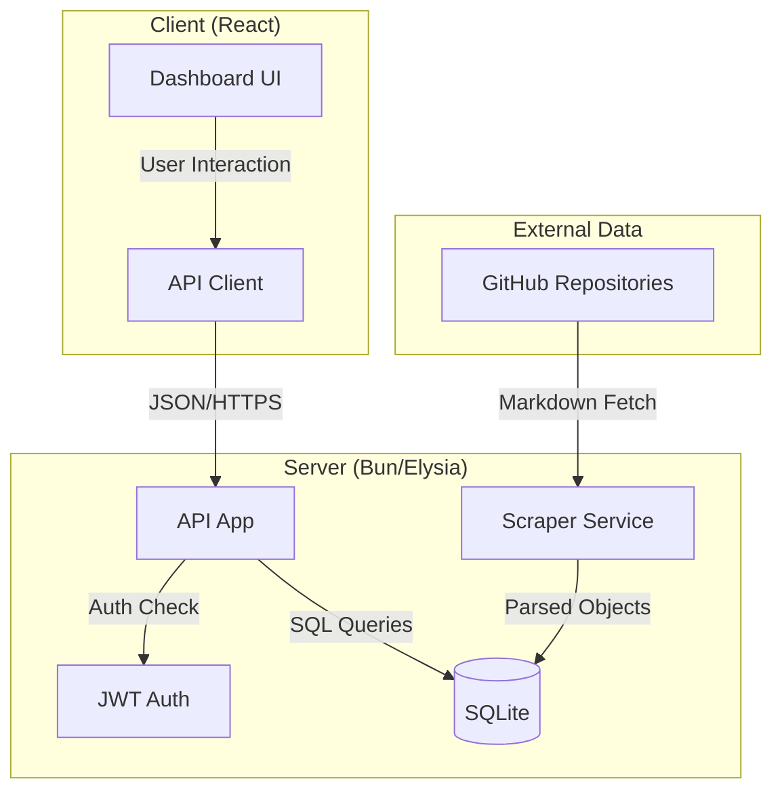
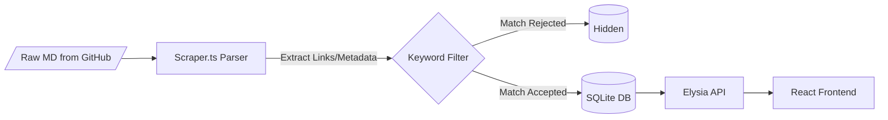
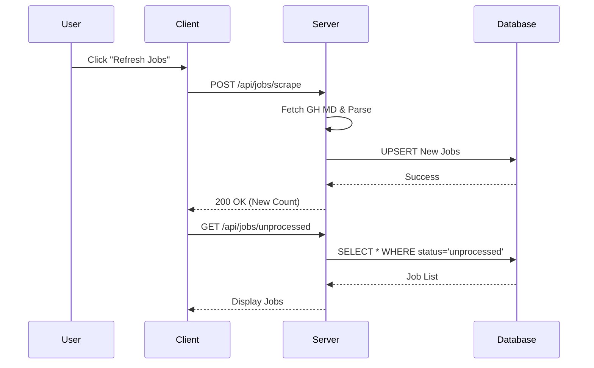

<!--
  Generated by AI-Powered README Generator
  Repository: https://github.com/WomB0ComB0/job-dashboard
  Generated: 2026-01-25T01:49:29.325Z
  Format: md
  Style: comprehensive
-->

# Job Dashboard

A comprehensive, Bun-native web application designed to aggregate, filter, and manage tech job applications from curated open-source repositories.


## Table of Contents

- [Overview](#overview)
- [Features](#features)
- [Architecture](#architecture)
- [Quick Start](#quick-start)
- [Usage & Examples](#usage--examples)
- [Configuration](#configuration)
- [API Reference](#api-reference)
- [Development](#development)
- [Troubleshooting](#troubleshooting)
- [Roadmap & Known Issues](#roadmap--known-issues)
- [License & Credits](#license--credits)

## Overview

The Job Dashboard is a specialized productivity tool built to solve the "application fatigue" experienced by students and new graduates. It replaces manual spreadsheet tracking and legacy CLI tools with a modern, high-performance web interface. By programmatically scraping GitHub-based job lists (like SimplifyJobs), it centralizes hundreds of listings into a single actionable interface.

The system uses a sophisticated keyword filtering engine to automatically discard irrelevant roles based on title matches, allowing users to focus only on positions that fit their profile. Built on the **Bun** runtime, it leverages extreme performance for both the SQLite-backed server and the React-based frontend.

**Who is this for?**
*   **Students & New Grads:** Seeking Summer 2026 internships or first-time full-time roles.
*   **Power Users:** Who want to automate the discovery of new job postings without manual repo browsing.
*   **Developers:** Looking for a high-performance template utilizing the ElysiaJS + Bun + React stack.

## Features

### 🔍 Smart Scraping & Discovery
*   ✨ **Automated Ingestion:** Fetches real-time data from curated GitHub repositories (SimplifyJobs Summer/New Grad lists).
*   ⚡ **Incremental Updates:** Detects new postings without duplicating existing records.
*   🎯 **Multi-Source Support:** Configurable targets for Summer internships, New Grad roles, and Off-season positions.

### 🛠️ Job Management
*   📥 **Status Tracking:** Mark jobs as `Applied`, `Skipped`, or `Processed` to clean up your view.
*   🏷️ **Keyword Filtering:** Define "Accepted" and "Rejected" title keywords to auto-hide irrelevant listings (e.g., hide "Senior" or "Medical").
*   📊 **Analytics:** Integrated dashboard showing application progress and top-hiring companies.

### 🛡️ Enterprise-Grade Foundation
*   🔒 **JWT Authentication:** Secure user sessions with Bcrypt password hashing.
*   🚀 **Bun Native:** Uses `bun:sqlite` for ultra-fast I/O and `ElysiaJS` for type-safe API routing.
*   🎨 **Tailwind 4 UI:** A modern, responsive interface using the latest Tailwind CSS features and Lucide icons.

## Architecture

The system follows a monolithic-repository architecture with clear separation between the scraping service, the SQLite persistence layer, and the React client.

### Component Relationship


### Data Flow


### Technology Stack
| Layer | Technology | Purpose |
| :--- | :--- | :--- |
| **Runtime** | Bun | JavaScript runtime, bundler, and test runner |
| **Backend** | ElysiaJS | High-performance, type-safe web framework |
| **Database** | SQLite | Local persistent storage via `bun:sqlite` |
| **Frontend** | React 19 | Component-based UI library |
| **Styling** | Tailwind CSS 4 | Utility-first CSS with latest engine |
| **Auth** | JWT / Bcrypt | Secure access and password protection |

## Quick Start

### Prerequisites
*   [Bun](https://bun.sh/) installed (v1.1.0 or higher)
*   A modern browser (Chrome, Firefox, Safari)

### Installation
1. Clone the repository:
   ```bash
   git clone https://github.com/WomB0ComB0/job-dashboard.git
   cd job-dashboard
   ```

2. Install dependencies:
   ```bash
   bun install
   ```

3. Set up environment variables:
   ```bash
   cp .env.example .env
   # Edit .env with your desired JWT_SECRET
   ```

### Running the Application
To run both backend and frontend in development mode with HMR:
```bash
bun dev
```
*   **API/Server:** `http://localhost:3000`
*   **Frontend:** `http://localhost:3000` (Bun serves the index.html)

## Usage & Examples

### Managing Keywords
The filtering logic is driven by `src/server/utils/keywords.ts`. You can configure these via the UI or by modifying the JSON store.

```typescript
// Example Logic: How keywords are evaluated
const isAccepted = (title: string, keywords: string[]) => {
  return keywords.some(kw => title.toLowerCase().includes(kw.toLowerCase()));
};
```

### Scraping Jobs
The scraper can be triggered via the UI "Refresh" button or via the CLI for testing:
```bash
# Run the legacy manager CLI to test scraper logic
bun run job-manager.ts
```

### Sequence: User Application Workflow


## Configuration

### Environment Variables
| Variable | Required | Default | Description |
| :--- | :--- | :--- | :--- |
| `PORT` | No | `3000` | Port the server listens on |
| `JWT_SECRET` | Yes | `super-secret` | Key for signing authentication tokens |
| `DB_PATH` | No | `./jobs.sqlite` | File path for the SQLite database |
| `NODE_ENV` | No | `development` | Environment mode |

### Directory Structure
```text
├── src/
│   ├── client/       # React components, Tailwind styles
│   ├── server/       # Elysia app, DB schema, Scraper service
│   │   ├── services/ # Business logic (Scraper)
│   │   └── utils/    # Shared utilities (Keywords)
├── index.ts          # Main entry point (Bun.serve)
└── job-manager.ts    # Legacy CLI management tool
```

## API Reference

### Authentication
*   `POST /auth/register` - Create a new user account.
*   `POST /auth/login` - Authenticate and receive JWT.

### Job Endpoints
| Method | Endpoint | Description |
| :--- | :--- | :--- |
| `GET` | `/api/jobs` | Retrieve all jobs (supports query filters) |
| `POST` | `/api/jobs/scrape` | Trigger the GitHub scraper |
| `PATCH` | `/api/jobs/:id` | Update job status (Applied/Skipped) |
| `GET` | `/api/stats` | Get aggregate application metrics |

### Example Request (Update Status)
```bash
curl -X PATCH http://localhost:3000/api/jobs/123 \
  -H "Authorization: Bearer <token>" \
  -H "Content-Type: application/json" \
  -d '{"status": "applied"}'
```

## Development

### Running Tests
This project uses `bun test` for high-speed unit and integration testing.
```bash
# Run all tests
bun test

# Run specific test file
bun test src/index.test.ts
```

### Local Setup
The project uses `Bun.serve` for handling both the API and static file serving. In development mode, HMR is enabled for the frontend.
*   **Database:** Uses `bun:sqlite`. The first time the app runs, it will create `jobs.sqlite` in the root directory.
*   **Linting:** Recommended to use Prettier for code formatting.

## Troubleshooting

| Error Message | Cause | Solution |
| :--- | :--- | :--- |
| `Failed to fetch: GitHub API rate limit` | Too many scraper requests in short succession. | Wait 15 minutes or use a personal access token (if configured). |
| `Database is locked` | Concurrent write operations on SQLite. | Restart the server; `bun:sqlite` handles this, but high-load CLI usage may lock it. |
| `Invalid JWT token` | Secret key mismatch or token expired. | Re-login to generate a new session token. |

## Roadmap & Known Issues

### Roadmap
- [ ] **Multi-user Isolation:** Currently, jobs are shared; implement user-specific job status tables.
- [ ] **Email Notifications:** Alert users when a job matching high-priority keywords is found.
- [ ] **Direct Application:** Integration with browser extensions to auto-fill applications.
- [ ] **AI Summarization:** Use LLMs to summarize job descriptions from application links.

### Known Limitations
*   ⚠️ **Scraper Fragility:** The scraper relies on the Markdown structure of specific GitHub repos. If the repo maintainers change their table format, the scraper will require an update in `src/server/services/scraper.ts`.
*   ⚠️ **Memory Usage:** Large batches of job processing (>5000) may see temporary spikes in memory during parsing.

## License & Credits

**License:** Distributed under the MIT License. See `LICENSE` for more information.

**Credits:**
*   Data provided by the amazing community at [SimplifyJobs](https://github.com/SimplifyJobs).
*   Built with [Bun](https://bun.sh) and [ElysiaJS](https://elysiajs.com).
*   Icons by [Lucide](https://lucide.dev).

**Maintainer:** [WomB0ComB0](https://github.com/WomB0ComB0)