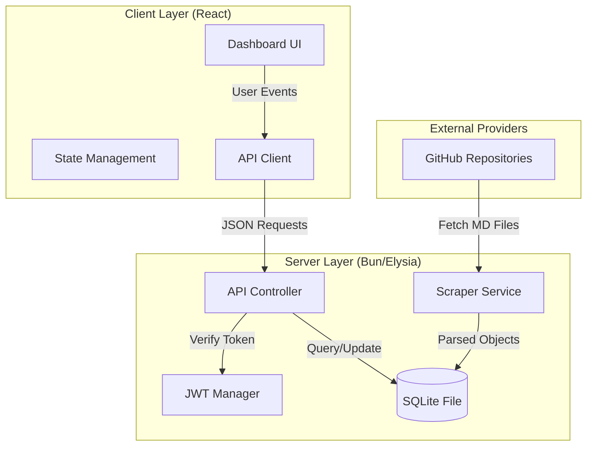
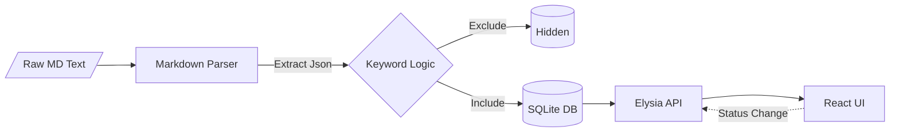
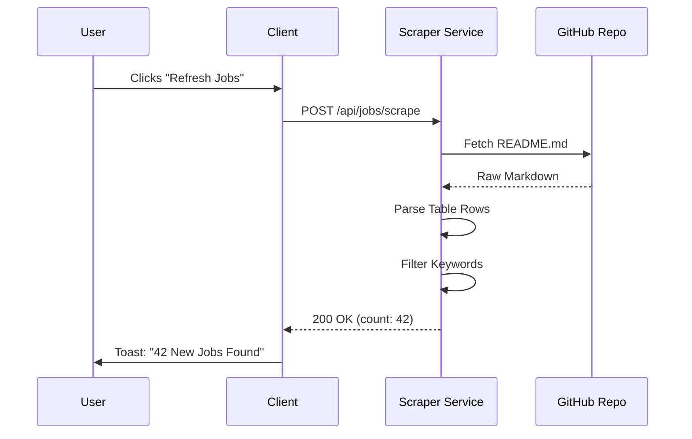

<!--
  Generated by AI-Powered README Generator
  Repository: https://github.com/WomB0ComB0/job-dashboard
  Generated: 2026-01-25T02:17:39.916Z
  Format: md
  Style: comprehensive
-->

# Job Dashboard

A high-performance, Bun-native application for aggregating, filtering, and managing tech job listings from curated open-source repositories.


## Table of Contents

- [Overview](#overview)
- [Features](#features)
- [Architecture](#architecture)
- [Quick Start](#quick-start)
- [Usage & Examples](#usage--examples)
- [Configuration](#configuration)
- [API Reference](#api-reference)
- [Development](#development)
- [Troubleshooting](#troubleshooting)
- [Roadmap & Known Issues](#roadmap--known-issues)
- [License & Credits](#license--credits)

## Overview

The **Job Dashboard** is a productivity-focused platform designed to eliminate "application fatigue." Navigating hundreds of GitHub-based job repositories manually is inefficient and prone to error. This tool programmatically scrapes, parses, and centralizes data from major industry repositories (such as SimplifyJobs) into a clean, actionable web interface.

Built on the **Bun** runtime, the system prioritizes speed and developer experience. It utilizes `bun:sqlite` for near-instant data persistence and `ElysiaJS` for a type-safe, high-throughput backend. By integrating a customizable keyword filtering engine, users can automatically suppress roles that don't match their profile (e.g., filtering out "Senior" roles when looking for Internships), ensuring every listing displayed is relevant.

**Who is this for?**
*   **Students & New Grads:** Seeking Summer 2026 internships or first-time full-time roles without manual repo-crawling.
*   **Power Users:** Who want to automate job discovery and maintain a historical record of their application status.
*   **Full-Stack Developers:** Interested in a reference implementation of the Bun + Elysia + React + Tailwind 4 stack.

## Features

### 🔍 Discovery & Ingestion
*   ✨ **Automated Scraping:** Fetches real-time job data directly from curated GitHub Markdown files.
*   ⚡ **Incremental Updates:** Uses intelligent UPSERT logic to identify new roles without duplicating existing entries.
*   🎯 **Multi-Source Support:** Pre-configured for Summer Internships, New Grad roles, and Off-season positions.

### 🛠️ Job Management
*   📥 **Status Tracking:** One-click updates for marking roles as `Applied`, `Skipped`, or `Interviewing`.
*   🏷️ **Keyword Engine:** Powerful filtering logic to auto-hide listings based on "Accepted" or "Rejected" title keywords.
*   📊 **Visual Analytics:** Dashboard metrics showing application volume and conversion rates.

### 🛡️ Technical Excellence
*   🔒 **Secure Auth:** JWT-based sessions with Bcrypt password hashing for multi-user support.
*   🚀 **Modern Stack:** Leverages React 19 and Tailwind CSS 4 for a responsive, performant UI.
*   💾 **Persistent Storage:** Local SQLite database ensures fast, zero-config data management.

## Architecture

The system follows a monolithic-repository architecture where the Bun runtime serves both the API and the static frontend assets.

### System Components


### Data Transformation Flow


### Technology Stack
| Layer | Technology | Purpose |
| :--- | :--- | :--- |
| **Runtime** | Bun | JavaScript execution, bundler, and test runner |
| **Backend** | ElysiaJS | High-performance, Type-safe web framework |
| **Database** | SQLite | Local relational storage via `bun:sqlite` |
| **Frontend** | React 19 | Declarative UI components |
| **Styling** | Tailwind 4 | Utility-first CSS with Oxide engine |
| **Auth** | JWT | Stateless authentication for API security |

## Quick Start

### Prerequisites
- **Bun:** [v1.1.0 or higher](https://bun.sh/)
- **Git:** For repository cloning

### Installation

1. **Clone the repository:**
   ```bash
   git clone https://github.com/WomB0ComB0/job-dashboard.git
   cd job-dashboard
   ```

2. **Install dependencies:**
   ```bash
   bun install
   ```

3. **Configure environment:**
   ```bash
   cp .env.example .env
   # Open .env and set your JWT_SECRET
   ```

### Running the Application

Start the development server (runs both backend and frontend):
```bash
bun dev
```

The application will be available at `http://localhost:3000`.

## Usage & Examples

### 1. The Scraping Cycle
The scraper parses Markdown tables from GitHub. When triggered, it performs the following sequence:



### 2. Custom Keyword Logic
The engine uses a simple inclusion/exclusion system. You can modify these in `src/server/utils/keywords.ts`.

```typescript
// Example Logic
const REJECT_KEYWORDS = ['Senior', 'Staff', 'Lead', 'Manager'];
const ACCEPT_KEYWORDS = ['Intern', 'New Grad', 'Junior', '2026'];

/**
 * Filter evaluation:
 * 1. If title contains REJECT, hide.
 * 2. If title contains ACCEPT, show.
 */
```

### 3. CLI Management
For administrative tasks or testing the scraper independently of the UI:
```bash
bun run job-manager.ts --scrape
```

## Configuration

### Environment Variables
| Variable | Required | Default | Description |
| :--- | :--- | :--- | :--- |
| `PORT` | No | `3000` | Port for the web server |
| `JWT_SECRET` | Yes | `changeme` | Secret key for signing auth tokens |
| `DB_PATH` | No | `./jobs.sqlite` | File system path for SQLite database |
| `NODE_ENV` | No | `development` | Runtime environment mode |

### Directory Structure
```text
├── src/
│   ├── client/       # React frontend (Vite-style)
│   ├── server/       # Elysia backend
│   │   ├── services/ # Scraper and Business logic
│   │   ├── db.ts     # Database schema and connection
│   │   └── utils/    # Helper functions
├── index.ts          # Server entry point
└── job-manager.ts    # CLI utility
```

## API Reference

### Authentication
`POST /auth/register` | `POST /auth/login`
- **Payload:** `{ "username": "string", "password": "password" }`
- **Return:** `{ "token": "jwt_string" }`

### Jobs Management
| Method | Endpoint | Description |
| :--- | :--- | :--- |
| `GET` | `/api/jobs` | Get all jobs (supports `?status=applied`) |
| `POST` | `/api/jobs/scrape` | Trigger manual repository sync |
| `PATCH` | `/api/jobs/:id` | Update job status or metadata |
| `DELETE` | `/api/jobs/:id` | Remove a job listing |

### Statistics
`GET /api/stats`
- **Return:** Aggregate data for the dashboard (total applied, pending, etc.)

## Development

### Running Tests
The project uses the native Bun test runner.
```bash
# Run all tests
bun test

# Run specific integration tests
bun test src/integration.test.ts
```

### Coding Standards
- **Formatting:** Handled by Prettier. Run `bun x prettier --write .`.
- **Linting:** Logic verified via TypeScript in strict mode.
- **Commits:** Follow conventional commits (e.g., `feat:`, `fix:`, `docs:`).

## Troubleshooting

| Issue | Possible Cause | Solution |
| :--- | :--- | :--- |
| `Error: SQLite: Busy` | Multiple processes accessing DB | Ensure only one `bun dev` or CLI instance is running. |
| `Scraper 0 jobs found` | GitHub Rate Limiting | Wait 60s or provide a `GITHUB_TOKEN` (if configured). |
| `JWT Invalid` | Missing Secret | Ensure `JWT_SECRET` is set in `.env` and matches the login session. |

## Roadmap & Known Issues

- [x] Initial React 19 + Tailwind 4 implementation
- [x] SQLite persistence layer
- [ ] Add LinkedIn/Indeed scraper integration
- [ ] Implement email/browser notifications for new matches
- [ ] Add multi-user account isolation (currently global view)

⚠️ **Known Issue:** The scraper may fail if the target GitHub repository drastically changes its Markdown table formatting.

## License & Credits

- **License:** MIT
- **Data Sources:** Huge thanks to the [SimplifyJobs](https://github.com/SimplifyJobs) community for maintaining the primary job lists used by this tool.
- **Maintainer:** [WomB0ComB0](https://github.com/WomB0ComB0)